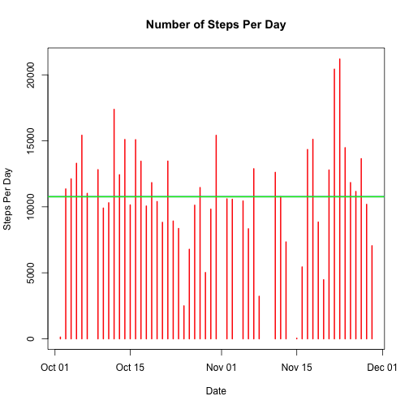
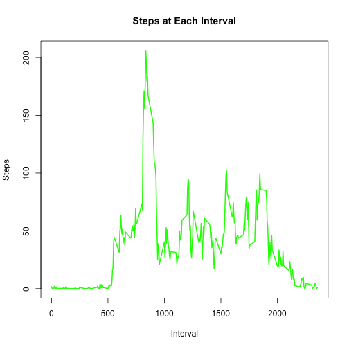
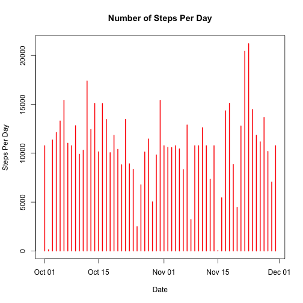
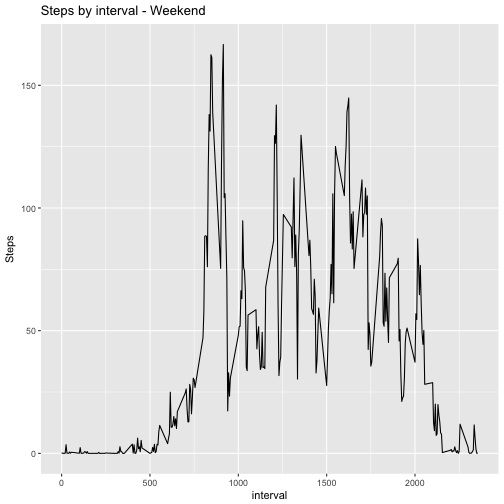

##SECTION 1: Calculating and plotting the mean of the total number of steps per day

###Step 1a: Load the data

```r
knitr::opts_chunk$set(echo = TRUE)
setwd("~/Documents/Studying/Rcourse/RepData_PeerAssessment1/RepData_PeerAssessment1")
data <- read.csv("activity.csv")
```

###Step 1b: Process data to make it ready for plotting and analysis

```r
knitr::opts_chunk$set(echo = TRUE)
data$date <- as.Date(data$date)
data <- na.omit(data)
steps <- aggregate(steps~date,data,sum)
```

###Step 1c: Plotting

```r
knitr::opts_chunk$set(echo = TRUE)
plot(steps$date,steps$steps,type = "h",main = "Number of Steps Per Day",xlab = "Date",ylab = "Steps Per Day",col = "red",lwd = 2)
abline(h = mean(steps$steps),col = "blue",lwd = 2)
abline(h = median(steps$steps),col = "green",lwd = 2)
```



###Step 1d: Calculate mean & median

```r
knitr::opts_chunk$set(echo = TRUE)
paste("Mean Steps Per Day =",mean(steps$steps))
```

```
## [1] "Mean Steps Per Day = 10766.1886792453"
```

```r
paste("Median Steps Per Day =",median(steps$steps))
```

```
## [1] "Median Steps Per Day = 10765"
```

##SECTION 2: Calculating and plotting the average daily activity pattern by interval

###Step 2a: Reprocess data to calculate by interval

```r
knitr::opts_chunk$set(echo = TRUE)
inter <- aggregate(steps~interval,data,mean)
```

###Step 2b: Plotting

```r
knitr::opts_chunk$set(echo = TRUE)
plot(inter$interval,inter$steps,type = "l",main = "Steps at Each Interval",xlab = "Interval",ylab = "Steps",col = "Green",lwd = 2)
```



###Step 2c: Find the maximum interval

```r
knitr::opts_chunk$set(echo = TRUE)
paste("Interval with maximum steps =",inter$interval[which(inter$steps==max(inter$steps))])
```

```
## [1] "Interval with maximum steps = 835"
```

```r
paste("Maximum mean steps =",max(inter$steps))
```

```
## [1] "Maximum mean steps = 206.169811320755"
```

##SECTION 3: Imputing missing values to replace NAs in data set and compare results

###Step 3a: Calculate total number of missing values

```r
knitr::opts_chunk$set(echo = TRUE)
activity <- read.csv("activity.csv")
sum(is.na(activity$steps))
```

```
## [1] 2304
```

###Step 3b: Strategy of dealing with missing value
Because the number of steps in same intervals of different days tend to be similar, I will use the mean number of steps of that interval to replace the missing values in the dataset.

###Step 3c: Create new data set with imputed NA

```r
knitr::opts_chunk$set(echo = TRUE)
step2 <- merge(activity,inter,by = "interval")
naIndex <- which(is.na(step2$steps.x))
activity2 <- activity
step2$steps.x[naIndex] = step2$steps.y[naIndex]
```

###Step 3d: Plotting

```r
knitr::opts_chunk$set(echo = TRUE)
step3 <- aggregate(steps.x~date,step2,sum)
step3$date <- as.Date(step3$date)
plot(step3$date,step3$steps.x,type = "h",main = "Number of Steps Per Day",xlab = "Date",ylab = "Steps Per Day",col = "red",lwd = 2)
```



###Step 3e: Calculate mean & median

```r
knitr::opts_chunk$set(echo = TRUE)
paste("Mean daily steps =",mean(step3$steps.x))
```

```
## [1] "Mean daily steps = 10766.1886792453"
```

```r
paste("Median daily steps =",median(step3$steps.x))
```

```
## [1] "Median daily steps = 10766.1886792453"
```
Imputing missing values in the dataset increases mean and median of daily steps a little, 1.2% % 2.3% respectively, which is not a significant change. So we can conclude that missing values won't have a great impact on estimates on the total daily number of steps.

##SECTION 4: Check if differences exist in activity patterns between weekdays and weekends

###Step 4a: Distinguish between weekdays & weekends

```r
knitr::opts_chunk$set(echo = TRUE)
step2$date <- as.Date(step2$date)
step2$weekday <- weekdays(step2$date)
step2$weeks <- rep(NA,nrow(step2))
for(i in 1:nrow(step2)){
  if (step2$weekday[i]=="Saturday"|step2$weekday[i]=="Sunday"){
    step2$weeks[i] <- "weekend"
  } else {step2$weeks[i] <- "weekday"}
}
```

###Step 4b: Plotting

```r
knitr::opts_chunk$set(echo = TRUE)
weekd <- step2[step2$weeks=="weekday",]
weeke <- step2[step2$weeks=="weekend",]
sum1 <- aggregate(steps.x~interval,weekd,mean)
sum2 <- aggregate(steps.x~interval,weeke,mean)
library(ggplot2)
par(mfrow = c(2,1))
qplot(interval,steps.x,data = sum1,geom = "line",main = "Steps by interval - Weekday",ylab = "Steps")
```


```r
qplot(interval,steps.x,data = sum2,geom = "line",main = "Steps by interval - Weekend",ylab = "Steps")
```


